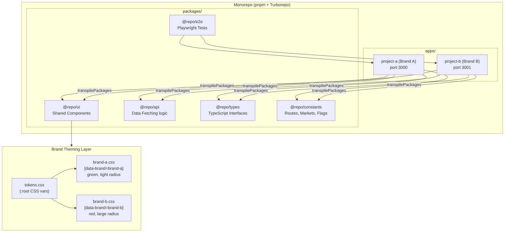
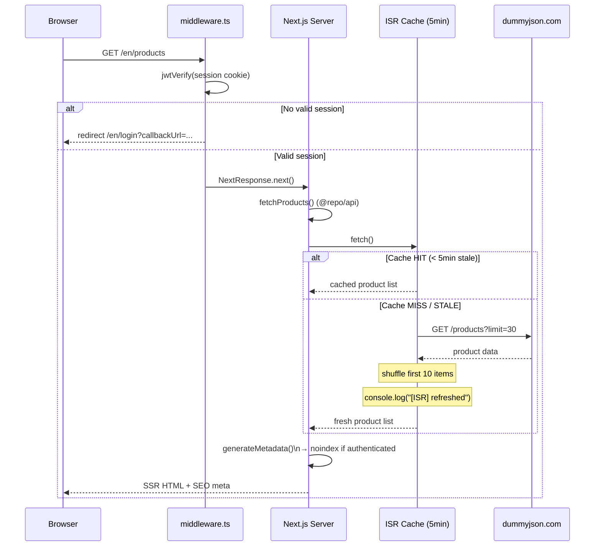
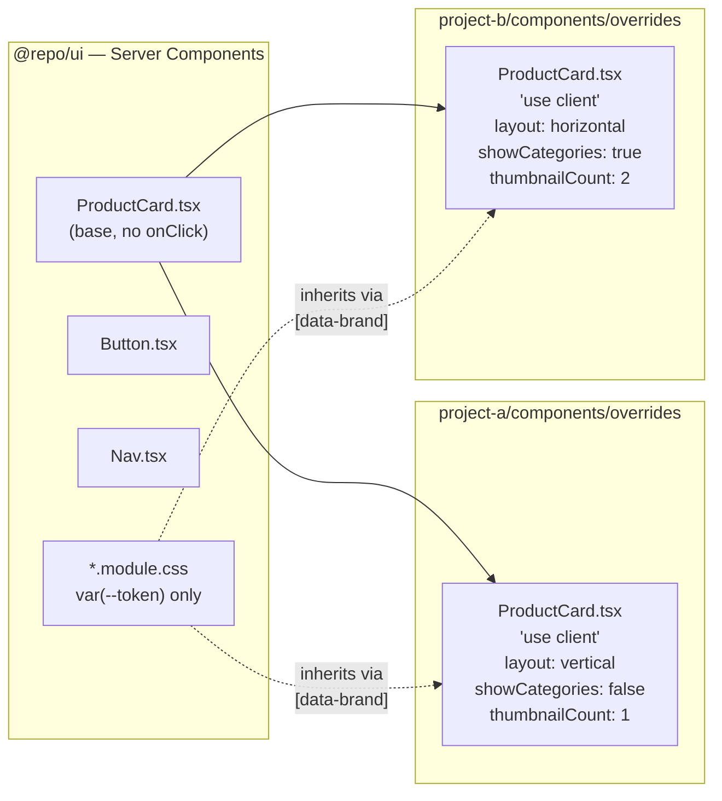
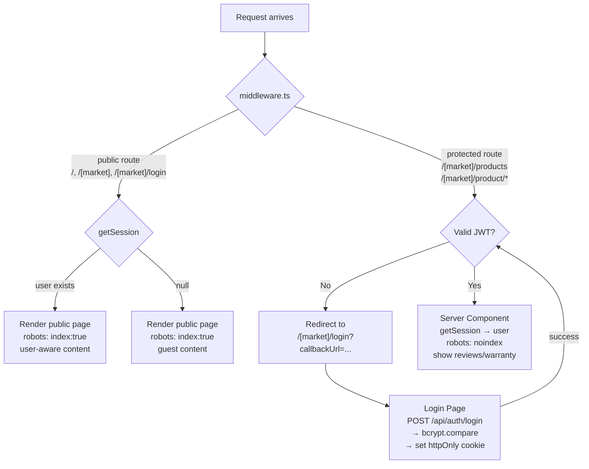
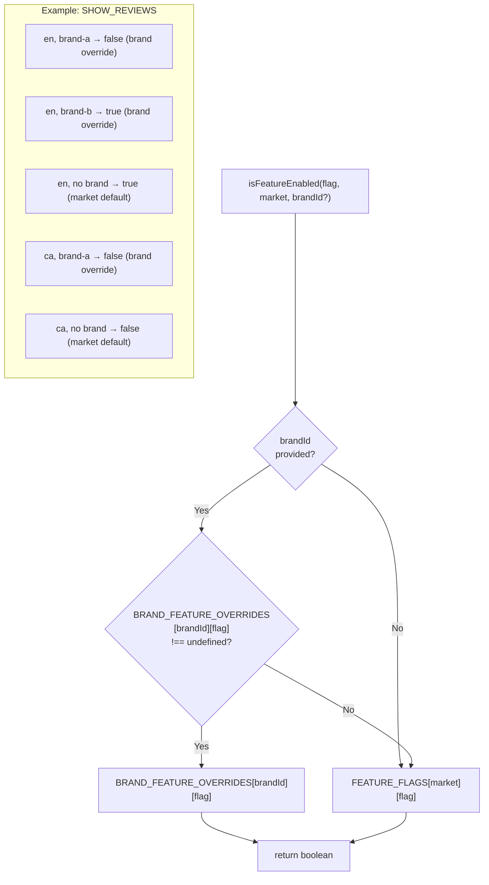

# Architecture Documentation

This document describes the architecture decisions, patterns, and flows implemented in the Rhino Marketplace multi-brand monorepo.

## Table of Contents

1. [Overview](#1-overview)
2. [System Architecture](#2-system-architecture)
3. [Request Lifecycle](#3-request-lifecycle)
4. [Component Architecture](#4-component-architecture)
5. [Authentication & SEO](#5-authentication--seo)
6. [Folder Structure](#6-folder-structure)
7. [CSS Design System](#7-css-design-system)
8. [Type System](#8-type-system)
9. [Feature Flags](#9-feature-flags)
10. [Code Quality](#10-code-quality)
11. [Testing Strategy](#11-testing-strategy)
12. [Docker Deployment](#12-docker-deployment)
13. [Adding a New Brand](#13-adding-a-new-brand)
14. [Common Pitfalls](#14-common-pitfalls)

---

## 1. Overview

### Project Goals

Build a **multi-brand white-label marketplace** where:
- Multiple frontend applications share a common UI kit
- Each brand maintains distinct visual identity
- Features can be toggled per market and brand
- Apps deploy independently

### Technology Stack

| Layer | Technology | Rationale |
|-------|------------|-----------|
| Framework | Next.js 16.1 + React 19.2 | App Router, Server Components, ISR |
| Package Manager | pnpm 10 | Fast installs, workspace support |
| Task Runner | Turborepo 2.8 | Caching, parallel builds |
| Language | TypeScript 5.7 (strict) | Type safety, IDE support |
| Styling | CSS Modules + Custom Properties | Zero runtime, SSR-safe |
| Linting | Biome | Single tool replaces ESLint + Prettier |
| Auth | jose + bcryptjs | Edge Runtime compatible JWT |
| Testing | Jest 30 + Playwright | Unit + E2E coverage |

### Key Architectural Principles

1. **JIT Package Strategy** — No build step for packages; raw TypeScript transpiled by Next.js
2. **Zero-Runtime Theming** — CSS custom properties scoped to `[data-brand]` attribute
3. **Server Components by Default** — Client Components only when interactivity required
4. **Type Safety Without Runtime Overhead** — Type guards for validation, no Zod dependency

---

## 2. System Architecture



### JIT Package Strategy

Packages are **not compiled separately**. Instead:

1. Each package exports raw TypeScript via `package.json` exports
2. Apps use `transpilePackages` in `next.config.ts`
3. Next.js transpiles packages during app build

```typescript
// apps/project-a/next.config.ts
const nextConfig: NextConfig = {
  transpilePackages: ['@repo/ui', '@repo/types', '@repo/constants', '@repo/api'],
  output: 'standalone',
};
```

**Benefits:**
- No separate build step for packages
- Hot reload works across packages
- Single TypeScript compilation pass

---

## 3. Request Lifecycle



### ISR Implementation

Products page uses Incremental Static Regeneration with 5-minute revalidation:

```typescript
// packages/api/src/products.ts
export async function fetchProducts(options: FetchProductsOptions = {}): Promise<ProductList> {
  const { shuffle = false, next = { revalidate: 300, tags: ['products'] } } = options;
  const res = await fetch(
    'https://dummyjson.com/products?limit=30&select=id,title,...',
    { next },
  );
  // ... shuffle logic
  return { ...data, products: shuffled };
}

// Usage in apps/project-a/app/[market]/products/page.tsx
const { products } = await fetchProducts({ shuffle: true });
```

**Why `fetch()` with revalidate?**
- Stable ISR via `fetch()` options is production-ready
- `revalidate` and `tags` provide tagged invalidation
- Simpler debugging and cache visibility

---

## 4. Component Architecture



### Base + Override Pattern

**Base Components** (`@repo/ui`):
- Server Components by default
- Accept all variants via props
- Use CSS custom properties only
- No hardcoded values

**Brand Overrides** (`apps/*/components/overrides/`):
- `'use client'` when interactivity needed
- Pre-configure brand-specific defaults
- Wrap base component, don't fork it

```tsx
// apps/project-a/components/overrides/ProductCard.tsx
'use client';

import { ProductCard as BaseProductCard } from '@repo/ui';
import type { Market, Product } from '@repo/types';

export function ProductCard({ product, market }: Props) {
  const router = useRouter();

  return (
    <BaseProductCard
      product={product}
      layout="vertical"           // Brand A default
      showCategories={false}      // Brand A default
      thumbnailCount={1}          // Brand A default
      actionLabel="View Details"
      onAction={() => router.push(ROUTES.product(market, product.id))}
    />
  );
}
```

### Server vs Client Decision Tree

```
Does component need:
├─ onClick handlers? → 'use client'
├─ useState/useEffect? → 'use client'
├─ useRouter? → 'use client'
└─ None of above? → Server Component
```

---

## 5. Authentication & SEO



### JWT Session Management

```typescript
// lib/auth.ts
export async function createSession(user: UserPayload): Promise<void> {
  const token = await new SignJWT({ user })
    .setProtectedHeader({ alg: 'HS256' })
    .setExpirationTime('7d')
    .sign(getJwtKey());

  const cookieStore = await cookies();
  cookieStore.set('session', token, {
    httpOnly: true,              // Prevents XSS
    secure: production,          // HTTPS only
    sameSite: 'lax',            // CSRF protection
    path: '/',
  });
}

export async function getSession(): Promise<UserPayload | null> {
  // Returns null on any error — never throws
}
```

### Protected Routes

`middleware.ts` protects routes via regex patterns:

```typescript
const PROTECTED_PATTERNS = [
  /^\/[a-z]{2}\/products(\/.*)?$/,   // /en/products, /ca/products
  /^\/[a-z]{2}\/product\/.*$/,        // /en/product/123
];
```

### SEO Strategy

| User State | robots meta | Content Visibility |
|------------|-------------|-------------------|
| Unauthenticated | `index: true, follow: true` | Basic product info |
| Authenticated | `index: false, follow: false` | Full details + reviews |

**Rationale:** Prevent indexing of personalized/auth-gated content.

---

## 6. Folder Structure

```
rhino-monorepo/
├── apps/
│   ├── project-a/
│   │   ├── app/
│   │   │   ├── layout.tsx              # data-brand="brand-a", imports CSS
│   │   │   ├── page.tsx                # Redirects to /en
│   │   │   ├── [market]/
│   │   │   │   ├── layout.tsx          # Market validation, NavConfig
│   │   │   │   ├── page.tsx            # Welcome page
│   │   │   │   ├── login/page.tsx      # LoginForm wrapper
│   │   │   │   ├── products/
│   │   │   │   │   ├── page.tsx        # ISR product listing
│   │   │   │   │   └── loading.tsx     # Skeleton grid
│   │   │   │   └── product/[slug]/
│   │   │   │       ├── page.tsx        # SSG product detail
│   │   │   │       └── loading.tsx     # Skeleton
│   │   │   └── api/auth/
│   │   │       ├── login/route.ts      # POST login
│   │   │       └── logout/route.ts     # POST logout
│   │   ├── components/overrides/
│   │   │   └── ProductCard.tsx         # Brand A preset
│   │   ├── lib/
│   │   │   ├── auth.ts                 # JWT session helpers
│   │   │   └── market.ts               # Market content config
│   │   ├── data/users.json             # Bcrypt-hashed credentials
│   │   ├── middleware.ts               # Route protection
│   │   └── next.config.ts
│   │
│   └── project-b/                      # Same structure, Brand B presets
│
├── packages/
│   ├── api/
│   │   ├── src/
│   │   │   ├── products.ts             # fetchProducts implementation
│   │   │   └── index.ts
│   │   ├── package.json
│   │   └── tsconfig.json
│   │
│   ├── ui/
│   │   ├── src/components/
│   │   │   ├── Button/
│   │   │   ├── Nav/
│   │   │   ├── PageLayout/
│   │   │   ├── ProductCard/
│   │   │   └── LoginForm/
│   │   ├── styles/
│   │   │   ├── reset.css
│   │   │   ├── tokens.css
│   │   │   ├── brand-a.css
│   │   │   └── brand-b.css
│   │   └── src/index.ts
│   │
│   ├── types/src/
│   │   ├── product.ts                  # Product, ProductDetail, ProductList
│   │   ├── auth.ts                     # User, UserPayload, Session
│   │   ├── brand.ts                    # BrandId, NavConfig, BrandConfig
│   │   ├── market.ts                   # Market, MarketConfig, MarketContent
│   │   └── index.ts
│   │
│   ├── constants/src/
│   │   ├── markets.ts                  # MARKETS, isValidMarket()
│   │   ├── routes.ts                   # ROUTES helper functions
│   │   ├── brands.ts                   # BRAND_CONFIGS
│   │   ├── featureFlags.ts             # FEATURE_FLAGS, isFeatureEnabled()
│   │   └── index.ts
│   │
│   └── e2e/
│       ├── tests/
│       │   ├── auth.spec.ts
│       │   ├── products.spec.ts
│       │   └── brand.spec.ts
│       └── playwright.config.ts
│
├── biome.json
├── turbo.json
├── docker-compose.yml
└── pnpm-workspace.yaml
```

---

## 7. CSS Design System

### Token Architecture

All styling uses CSS custom properties defined in `packages/ui/styles/`:

```css
/* tokens.css — Base :root tokens */
:root {
  /* Colors */
  --color-primary: #0070f3;
  --color-primary-hover: #0060df;
  --color-bg: #ffffff;
  --color-surface: #f4f4f5;
  --color-text: #09090b;
  --color-text-muted: #71717a;

  /* Typography */
  --font-heading: 'Inter', system-ui, sans-serif;
  --text-sm: 0.875rem;
  --text-base: 1rem;
  --text-xl: 1.25rem;

  /* Spacing */
  --space-1: 0.25rem;
  --space-4: 1rem;
  --space-8: 2rem;

  /* Borders */
  --radius-sm: 4px;
  --radius-md: 8px;
  --radius-lg: 12px;
}
```

### Brand Theming

Brands override tokens via `[data-brand]` attribute selector:

```css
/* brand-a.css */
[data-brand="brand-a"] {
  --color-primary: #16a34a;       /* Green */
  --color-primary-hover: #15803d;
  --font-heading: 'Inter', sans-serif;
  --radius-md: 4px;               /* Tight corners */
}

/* brand-b.css */
[data-brand="brand-b"] {
  --color-primary: #dc2626;       /* Red */
  --color-primary-hover: #b91c1c;
  --font-heading: 'Georgia', serif;
  --radius-md: 16px;              /* Large corners */
}
```

### Root Layout Integration

```tsx
// apps/project-a/app/layout.tsx
import '@repo/ui/styles/reset.css';
import '@repo/ui/styles/tokens.css';
import '@repo/ui/styles/brand-a.css';  // Brand override

export default function RootLayout({ children }) {
  return (
    <html lang="en" data-brand="brand-a">
      <body>{children}</body>
    </html>
  );
}
```

**Zero Runtime Cost:** CSS custom properties are resolved by the browser, no JavaScript theming library needed.

---

## 8. Type System

### Shared Types (`@repo/types`)

```typescript
// product.ts
export interface Product {
  readonly id: number;
  title: string;
  price: number;
  thumbnail: string;
  images: readonly string[];
  // ...
}

// auth.ts
export type UserPayload = Omit<User, 'passwordHash'>;

// market.ts
export type Market = 'en' | 'ca';
```

### Type Guards

Runtime validation without Zod:

```typescript
// packages/constants/src/markets.ts
export function isValidMarket(value: unknown): value is Market {
  return MARKETS.includes(value as Market);
}

// Usage in Server Component
const { market } = await params;
if (!isValidMarket(market)) {
  notFound();  // Returns 404
}
// market is now typed as Market
```

---

## 9. Feature Flags



### Configuration

```typescript
// packages/constants/src/featureFlags.ts
export type FeatureFlag = 'SHOW_REVIEWS' | 'ENABLE_WISHLIST' | 'SHOW_RELATED_PRODUCTS';

// Market defaults
export const FEATURE_FLAGS: Record<Market, Record<FeatureFlag, boolean>> = {
  en: { SHOW_REVIEWS: true, ENABLE_WISHLIST: true, SHOW_RELATED_PRODUCTS: false },
  ca: { SHOW_REVIEWS: false, ENABLE_WISHLIST: false, SHOW_RELATED_PRODUCTS: true },
};

// Brand overrides (take precedence)
export const BRAND_FEATURE_OVERRIDES: Partial<Record<BrandId, Partial<Record<FeatureFlag, boolean>>>> = {
  'brand-a': { SHOW_REVIEWS: false },
  'brand-b': { SHOW_REVIEWS: true },
};
```

### Usage

```typescript
const showReviews = isFeatureEnabled('SHOW_REVIEWS', market, 'brand-a');
// en + brand-a → false (brand override)
// en + brand-b → true (brand override)
// ca + brand-a → false (brand override takes precedence over market)
```

---

## 10. Code Quality

### Biome Configuration

Biome replaces both ESLint and Prettier with a single, faster tool.

| Rule | Enforcement | Rationale |
|------|-------------|-----------|
| `noExplicitAny` | Error | Use `unknown` + type guard |
| `noUnusedImports` | Error | Clean imports |
| `useImportType` | Error | Type-only imports |
| `noConsoleLog` | Warn | Exception for ISR marker |
| `useButtonType` | Error | Accessibility |
| `useAltText` | Error | Accessibility |
| `noExcessiveCognitiveComplexity` | Error (≤12) | Maintainability |

### Pre-commit Hooks

```json
// package.json
{
  "simple-git-hooks": {
    "pre-commit": "pnpm lint-staged"
  },
  "lint-staged": {
    "**/*.{ts,tsx,js,jsx,json}": ["biome check --write"]
  }
}
```

---

## 11. Testing Strategy

### Unit Tests (Jest)

- Test pure functions and isolated component logic
- CSS Modules proxied via `identity-obj-proxy`
- Located alongside components: `Component.test.tsx`

### E2E Tests (Playwright)

```typescript
// packages/e2e/playwright.config.ts
export default defineConfig({
  projects: [
    { name: 'project-a', use: { baseURL: 'http://localhost:3000' } },
    { name: 'project-b', use: { baseURL: 'http://localhost:3001' } },
  ],
  webServer: [
    { command: 'pnpm --filter project-a dev', url: 'http://localhost:3000' },
    { command: 'pnpm --filter project-b dev', url: 'http://localhost:3001' },
  ],
});
```

**Test Categories:**
- `auth.spec.ts` — Login, logout, redirects
- `products.spec.ts` — Listing, detail, auth-gated content
- `brand.spec.ts` — Layout classes, category visibility

---

## 12. Docker Deployment

### Multi-Stage Build

```dockerfile
# Stage 1: Install dependencies
FROM node:20-alpine AS deps
RUN corepack enable && corepack prepare pnpm@latest --activate
COPY pnpm-lock.yaml ./
RUN pnpm install --frozen-lockfile

# Stage 2: Build app
FROM node:20-alpine AS builder
COPY --from=deps /app/node_modules ./node_modules
COPY . .
RUN pnpm --filter project-a build

# Stage 3: Minimal runtime (~200MB)
FROM node:20-alpine AS runner
USER nextjs
COPY --from=builder /app/apps/project-a/.next/standalone ./
CMD ["node", "apps/project-a/server.js"]
```

### Key Decisions

| Decision | Rationale |
|----------|-----------|
| `output: 'standalone'` | Traces only used files, ~200MB vs 1GB |
| Non-root user (`nextjs`) | Security best practice |
| Secrets at runtime | Never bake `JWT_SECRET` into image layers |
| Separate images per brand | Independent deployment |

---

## 13. Adding a New Brand

### Step 1: Create App Directory

```bash
cp -r apps/project-a apps/project-c
```

### Step 2: Create Brand CSS

```css
/* packages/ui/styles/brand-c.css */
[data-brand="brand-c"] {
  --color-primary: #8b5cf6;  /* Purple */
  --font-heading: 'Roboto', sans-serif;
  --radius-md: 12px;
}
```

### Step 3: Update Constants

```typescript
// packages/constants/src/brands.ts
export const BRAND_IDS = ['brand-a', 'brand-b', 'brand-c'] as const;

export const BRAND_CONFIGS: Record<BrandId, BrandConfig> = {
  // ... existing
  'brand-c': { id: 'brand-c', name: 'Project C', navPosition: 'top' },
};
```

### Step 4: Configure App

```tsx
// apps/project-c/app/layout.tsx
import '@repo/ui/styles/brand-c.css';

<html data-brand="brand-c">
```

### Step 5: Create Component Overrides

```tsx
// apps/project-c/components/overrides/ProductCard.tsx
export function ProductCard(props) {
  return (
    <BaseProductCard
      layout="vertical"
      showCategories={true}
      // ... brand-c specific defaults
    />
  );
}
```

### Step 6: Add to Docker/Playwright

- Add service to `docker-compose.yml`
- Add project to `playwright.config.ts`

---

## 14. Common Pitfalls

| Pitfall | Solution |
|---------|----------|
| `params` accessed synchronously | Always `const { market } = await params` (Next.js 16) |
| `cookies()` called synchronously | Always `const store = await cookies()` |
| Using `any` to silence errors | Use `unknown` + type guard |
| CSS hardcoded values | Only `var(--token-name)` in components |
| `console.log` without ignore | Add `// biome-ignore lint/suspicious/noConsoleLog: reason` |
| Missing `type` on buttons | Always `type="button"` or `type="submit"` |
| Importing across apps directly | Always go through `@repo/*` packages |
| JWT_SECRET in Docker build args | Inject at runtime via environment |
| Running container as root | Use `USER nextjs` in Dockerfile |

---

## Quick Reference

### Commands

```bash
pnpm dev                    # All apps
pnpm build:project-a        # Single brand build
pnpm check                  # Biome lint + format
pnpm test                   # Jest unit tests
pnpm test:e2e               # Playwright E2E
pnpm docker:up              # Start containers
```

### Key Files

| Purpose | Location |
|---------|----------|
| Route protection | `apps/*/middleware.ts` |
| JWT session | `apps/*/lib/auth.ts` |
| Base components | `packages/ui/src/components/` |
| CSS tokens | `packages/ui/styles/tokens.css` |
| Type definitions | `packages/types/src/` |
| Data fetching | `packages/api/src/products.ts` |
| Feature flags | `packages/constants/src/featureFlags.ts` |
